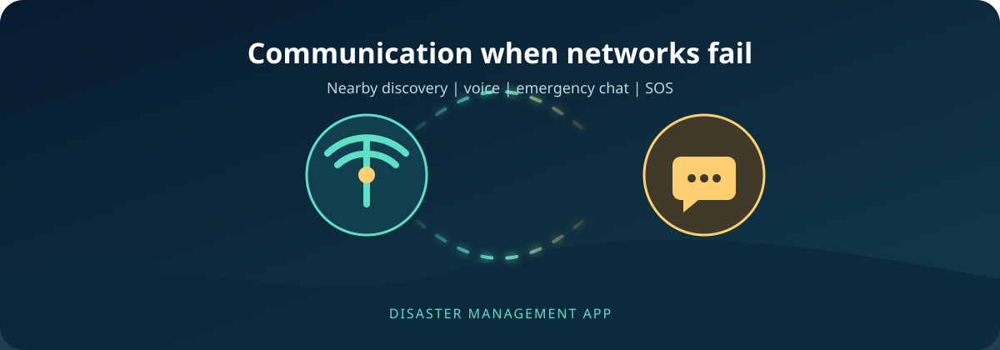
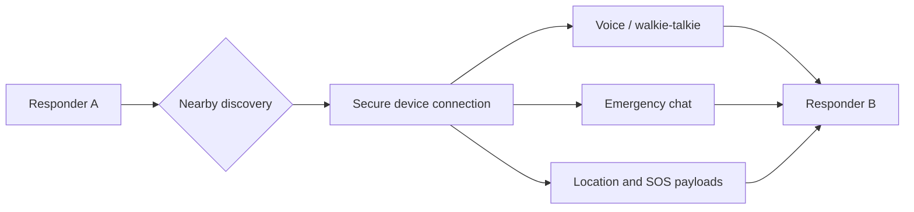

<div align="center">

# Disaster Management App



<br />


<p>
	A Flutter-based disaster response platform for alerts, emergency coordination,
	offline guidance, location intelligence, and resilient nearby communication.
</p>

<a href="frontend/">Flutter client</a> ·
<a href="backend/">Node.js API</a> ·
<a href="docs/ARCHITECTURE.md">Architecture</a>

<br /><br />


</div>

## Why this app

Disasters often damage the infrastructure people depend on. This app is built
around a simple priority: **critical communication should have a path forward
even when ordinary connectivity is unreliable**.

The headline capability is the offline communication suite. Nearby devices can
be discovered for emergency coordination, walkie-talkie style voice sessions,
emergency chat, and SOS workflows without depending on the normal API path.

## Offline communication first



### Included offline tools

- Nearby device discovery and connection management
- Walkie-talkie home, search, incoming connection, active call, and call history screens
- Push-to-talk audio capture, streaming, and playback services
- Emergency chat over nearby connections
- Offline emergency guides and cached map tiles
- Offline AI assistant with native TensorFlow Lite support
- SOS payloads containing emergency context and location when available
- Connection, audio, device-cache, permission, and location services

> Native Android and iOS builds use the device capabilities required by the
> offline communication stack. The web build intentionally disables native
> TensorFlow Lite inference and reports that limitation safely.

## Feature set

| Area | What it provides |
| --- | --- |
| **Emergency SOS** | Start, monitor, and cancel an emergency alert workflow |
| **Offline communication** | Nearby discovery, voice, emergency chat, SOS exchange, call history |
| **Walkie-talkie** | Push-to-talk experience for nearby responders |
| **Disaster map** | OpenStreetMap tiles, cached tiles, markers, shelters, hospitals, and location centering |
| **Shelters and relief** | Shelter listings, relief centers, availability, and detail views |
| **Reports** | Create, browse, and inspect disaster reports with attachments |
| **Alerts** | Disaster alerts, government alerts, severity, and notifications |
| **Weather** | Current conditions, forecasts, and weather summaries |
| **Offline guides** | Searchable emergency manuals for common disaster scenarios |
| **Offline AI** | On-device emergency question answering on native platforms |
| **Authentication** | Firebase-backed login, registration, password recovery, and guest entry points |
| **Profile and contacts** | Profile, settings, emergency contacts, and volunteer workflows |
| **Chat** | AI assistant and communication surfaces for response coordination |

## Technology

### Frontend

- Flutter and Dart
- Riverpod for state and dependency wiring
- GoRouter for navigation
- Freezed and JSON serialization for models
- Hive for local storage
- Dio and HTTP APIs
- Flutter Map with OpenStreetMap tiles
- Firebase Authentication and Messaging
- Nearby Connections, audio recording, geolocation, and cached map tiles
- TensorFlow Lite for native offline AI inference

### Backend

- Node.js and Express
- Prisma database access
- Firebase Admin authentication support
- Socket.IO for realtime communication
- Zod validation, Helmet security headers, CORS, rate limiting, and Winston logging
- Background jobs and file upload support

## Project layout

```text
.
├── frontend/                 Flutter application and platform runners
│   ├── lib/
│   │   ├── app/              Startup and root app composition
│   │   ├── core/             Shared infrastructure and routing
│   │   └── features/         Feature-first application code
│   ├── assets/               Images, manuals, ML files, and UI assets
│   └── test/                 Flutter tests
├── backend/                  Express API, Prisma, jobs, and sockets
├── docs/                     Architecture and documentation assets
└── scripts/generators/       Development-only code generators
```

See [docs/ARCHITECTURE.md](docs/ARCHITECTURE.md) for dependency direction,
compatibility boundaries, and the migration status.

## Quick start

### Requirements

- Flutter SDK with Android tooling for Android development
- Xcode for iOS or macOS development
- Node.js and npm for the backend
- An Android device/emulator or iOS simulator
- Firebase configuration for the platforms you intend to run

### Run the Flutter app

The Flutter project lives under `frontend/`, so Flutter commands must run there:

```bash
cd frontend
flutter pub get
flutter run
```

From the repository root, this is equivalent:

```bash
flutter -C frontend run
```

### Run the backend

```bash
cd backend
npm install
npm run dev
```

The API starts from `backend/src/server.js`. Database and Firebase credentials
are environment-specific and should be supplied through the backend environment
configuration rather than committed to the repository.

### Run generators

Generators are development tools and write into `frontend/`. Run them from the
repository root:

```bash
python3 scripts/generators/generate_home_ui.py
```

The Dart generator should be run with `dart` rather than `python3`:

```bash
dart scripts/generators/generate_models.dart
```

## Device permissions

The offline and location features need platform permissions:

- **Location:** centers the map and shares location in emergency workflows
- **Nearby devices / Bluetooth:** discovers nearby responders
- **Microphone:** records walkie-talkie audio
- **Notifications:** receives emergency and government alerts

On Android, enable location for the app under **Settings → Apps → Disaster
Management App → Permissions**. Also ensure device location services are enabled.

## Verification

```bash
# Flutter static analysis
cd frontend
flutter analyze

# Flutter tests
flutter test

# Backend syntax and app load
cd ../backend
node --check src/server.js
node -e "require('./src/app'); console.log('backend app load passed')"
```

The Android app has been trial-run on a connected device. Native platform
testing still depends on the local Android/iOS toolchain and device permissions.

## Development principles

- Keep emergency communication usable when the API is unavailable.
- Preserve route paths and public provider names during migrations.
- Keep feature behavior inside feature boundaries.
- Prefer cached or local data for degraded-network workflows.
- Validate native-only dependencies with a web-safe fallback when needed.

## Status

The app is under active development. The offline communication and walkie-talkie
flows are the primary product focus; backend contracts, device-specific behavior,
and production security configuration should be verified before deployment.
